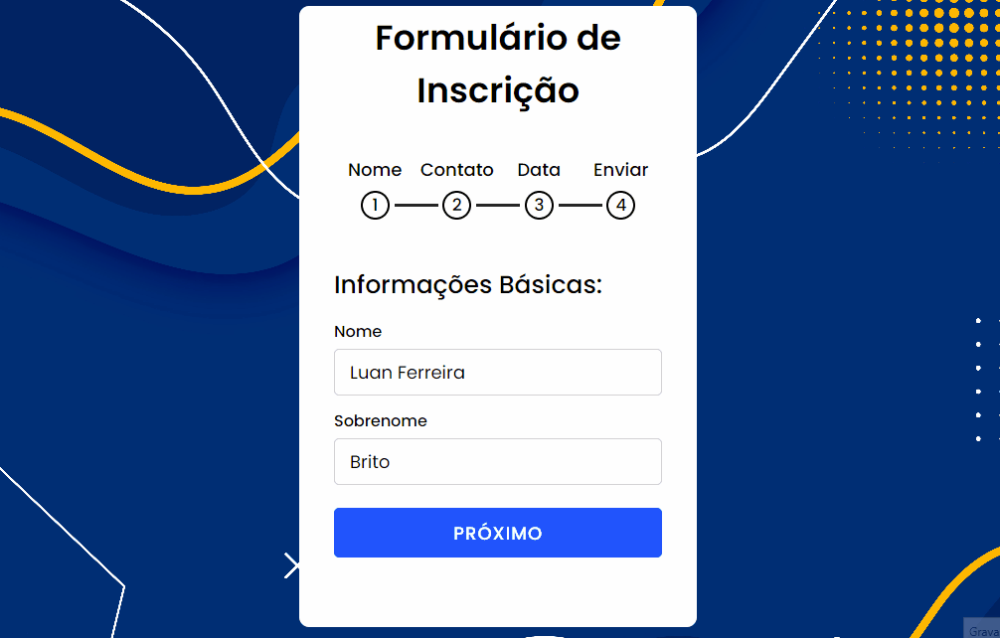

## 🧾 Descrição

Este projeto é um formulário de inscrição multi-etapas que permite aos usuários preencher informações em quatro etapas diferentes. Cada etapa é uma página que contém diferentes campos de entrada de informações. O usuário pode navegar entre as páginas utilizando botões "Próximo" e "Voltar". Quando todas as etapas são concluídas, o formulário pode ser enviado através do botão "Enviar". O JavaScript é utilizado para controlar a navegação entre as etapas do formulário.

<h1>

## 🔌 Tecnologias utilizadas

- **HTML:** linguagem de marcação usada para estruturar e apresentar o conteúdo da página;
- **CSS:** linguagem de estilo usada para estilizar a página, incluindo layout, fontes, cores, etc;
- **JavaScript:** Linguagem de programação que permite criar interações dinâmicas na web. Com ela é possível manipular o conteúdo HTML e CSS em tempo real, validar formulários, criar animações, entre outras possibilidades.
- **Font Awesome Icons (CDN):** Biblioteca de ícones vetoriais em escala que pode ser personalizada com CSS.
- **Google Fonts (CDN):** Serviço que disponibiliza uma coleção de fontes para uso na web, otimizadas para carregamento rápido.

## ⚙️ Estrutura

- **img:** Contém imagens utilizadas no projeto e para apresentação no Readme.md;
- **index.html:** Contém a linguagem de marcação usada para estruturar e apresentar o conteúdo da página;
- **style.css:** Contém regras de estilo que são usadas para personalizar a aparência da página HTML. Ele inclui configurações de fonte, cor de fundo, posicionamento e tamanho de elementos, e outras propriedades de estilo para tornar a página mais atraente e fácil de usar.
- **script.js:** Utilizado para controlar o fluxo de navegação entre as diferentes páginas do formulário presente no HTML. Ele seleciona os elementos relevantes da página, define a página atual e adiciona listeners para os botões de navegação. Quando um botão é clicado, ele move o slide para a próxima página e atualiza as classes e o estado do formulário. Além disso, ele também adiciona uma mensagem de sucesso após o envio do formulário.

## 🏳️ Como executar?

### **Passo 1**
Faça download do repositório

### **Passo 2**
Abra o arquivo "Index.html" em um navegador e teste as funções.

 

## ✅ Resultado (Preview)

### **Formulário**

 

## 💻 Autor: Luan Ferreira

Portfólio:
- [Github](https://github.com/fluanbrito)

Contato:
- [Linkedin](https://www.linkedin.com/in/luanferreirab/)

<h1>

## 🚀 Sobre mim
Sou um grande entusiasta e apaixonado por tecnologia, empreendedorismo e inovação. Hoje, estou a cursar o curso de Sistema de Informação pelo Instituto Federal, faço uso profissionalmente de ferramentas e me aprofundo em temas como Marketing, Machine Learning AWS, Metodologias ágeis, Gestão de Projetos, Programação Web, Administração de Sistemas, Redes de computadores, entre outros.
